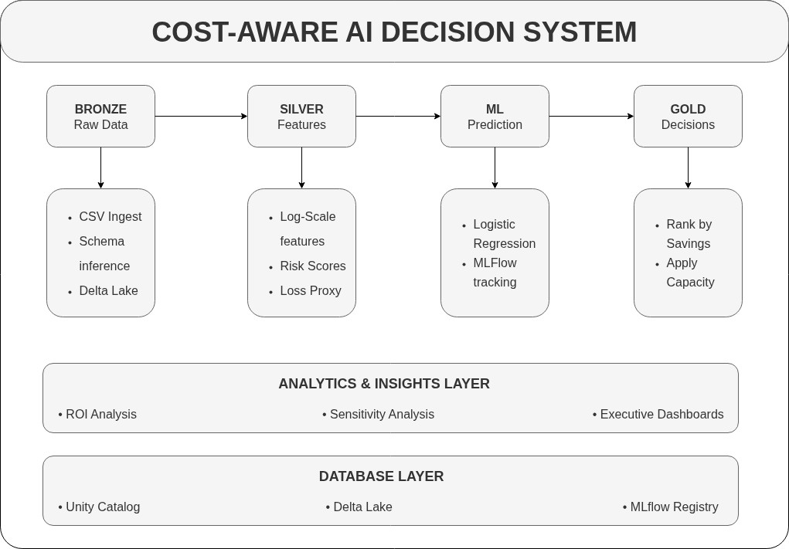

# Cost-Aware AI Decision System

> **"NexGen Financial Services loses $500K daily to fraud. With only 50 investigators, they prioritized by risk score alone—wasting resources on low-value cases. Our system optimizes for expected savings, capturing 55% more value with the same team."**

[](https://databricks.com)
[](https://delta.io)
[](https://mlflow.org)
[](https://python.org)

**For a quick executive overview, see the [Project Summary (PDF)](Project_summary.pdf)**

---

## Table of Contents

1. [Problem Definition and AI Framing](#1-problem-definition-and-ai-framing)
2. [Data Understanding and Feature Engineering](#2-data-understanding-and-feature-engineering)
3. [AI Innovation and Insight Generation](#3-ai-innovation-and-insight-generation)
4. [Model Selection and Technical Reasoning](#4-model-selection-and-technical-reasoning)
5. [Training, Evaluation and Metrics](#5-training-evaluation-and-metrics)
6. [Database to AI Workflow](#6-database-to-ai-workflow)
7. [Business Impact and Practical Use](#7-business-impact-and-practical-use)
8. [Documentation and Explainability](#8-documentation-and-explainability)
9. [Quick Start Guide](#9-quick-start-guide)
10. [Acknowledgments](#acknowledgments)

---

## 1. Problem Definition and AI Framing

### The Real-World Business Problem

**Global fraud losses exceed $32 billion annually.** Banks generate thousands of fraud alerts daily, but have limited investigation capacity. The critical question isn't *"Which transactions are fraudulent?"* but rather:

> **"Given limited resources, which cases should we investigate to maximize financial savings?"**

### Why Traditional Approaches Fail

| Approach | What It Does | Why It Fails |
|----------|--------------|--------------|
| Rule-based systems | Flag transactions above thresholds | Cannot adapt to evolving fraud patterns |
| Standard ML classifiers | Predict fraud probability | Ignores investigation costs and potential losses |
| Top-N by risk score | Investigate highest-risk cases | Misses low-risk but high-value cases |

### Our AI Formulation

We reframe fraud detection as a **constrained optimization problem**:

```
INPUT:  Transaction features, investigation costs, potential fraud losses
OUTPUT: Binary decision (Investigate: Yes/No) for each case
CONSTRAINT: Daily investigation capacity (e.g., 50 cases/day)
OBJECTIVE: Maximize total expected savings
```

This shifts the goal from **prediction accuracy** to **business value maximization**.

---

## 2. Data Understanding and Feature Engineering

### Dataset Overview

We use synthetic fraud data (`cost_aware_cases.csv`) with **120,000 cases** designed to simulate real banking scenarios:

| Column | Type | Business Meaning |
|--------|------|------------------|
| `case_id` | STRING | Unique identifier |
| `transaction_amount` | DOUBLE | Transaction value ($) |
| `tx_velocity_24h` | INT | Transaction frequency signal |
| `unusual_location_flag` | INT | Geographic anomaly indicator |
| `device_change_flag` | INT | Device fingerprint change |
| `account_age_days` | INT | Customer tenure |
| `investigation_cost` | DOUBLE | Resource cost per case ($75-$150) |
| `fraud_loss_if_missed` | DOUBLE | Potential loss if fraud ($500-$50,000) |
| `label_fraud` | INT | Ground truth label |

### Feature Engineering Pipeline

**Bronze to Silver Transformation** creates ML-ready features:

| Engineered Feature | Transformation | Business Rationale |
|--------------------|----------------|---------------------|
| `log_transaction_amount` | log1p(amount) | Stabilizes training for skewed distributions |
| `log_fraud_loss` | log1p(loss) | Normalizes high-variance loss values |
| `behavioral_risk_score` | velocity + location + device flags | Composite fraud signal |
| `expected_loss_proxy` | behavioral_score × log_fraud_loss | Pre-ML loss estimate |
| `cost_loss_ratio` | investigation_cost / fraud_loss | Efficiency indicator |

**Key Insight**: Traditional systems ignore `investigation_cost` and `fraud_loss_if_missed`. These are the most critical features for cost-aware decisioning.

---

## 3. AI Innovation and Insight Generation

### The Core Innovation

**Most fraud detection systems optimize the wrong objective.** They maximize prediction accuracy (AUC, F1) when the business goal is **maximizing financial savings**.

Our system introduces a **cost-aware decision layer** that transforms ML predictions into optimal business decisions:

```
Expected Savings = P(fraud) × Fraud_Loss_If_Missed - Investigation_Cost
```

### How It Works

```
Step 1: ML model predicts fraud probability → P(fraud)
Step 2: Calculate expected savings per case → E[savings]
Step 3: Rank all cases by E[savings] (descending)
Step 4: Select top-K cases where K = daily capacity
Step 5: Output: Investigate (Yes/No) decisions
```

### Why This Matters

| Scenario | Fraud Prob | Potential Loss | Investigation Cost | Expected Savings | Decision |
|----------|------------|----------------|-------------------|------------------|----------|
| Case A | 90% | $500 | $100 | $350 | Skip |
| Case B | 30% | $20,000 | $100 | $5,900 | Investigate |

**Traditional ML picks Case A (higher probability). Our system picks Case B (higher expected savings).**

### Novel Insight Generated

The system reveals that **20% of high-probability fraud cases have negative expected savings**—investigating them costs more than the potential loss. This insight is invisible to accuracy-focused systems.

---

## 4. Model Selection and Technical Reasoning

### Why Logistic Regression?

We chose **Logistic Regression** over complex models for specific technical reasons:

| Criterion | Logistic Regression | Random Forest | XGBoost |
|-----------|---------------------|---------------|---------|
| **Probability Calibration** | Naturally calibrated | Requires calibration | Requires calibration |
| **Interpretability** | Coefficients are interpretable | Black box | Black box |
| **Training Speed** | Fast | Moderate | Slow |
| **Decision Threshold Flexibility** | Direct probability output | Post-hoc calibration needed | Post-hoc calibration needed |

**Key Reason**: Our optimization layer requires **well-calibrated probabilities**. Logistic Regression provides this natively, while tree-based models often produce overconfident predictions that distort expected value calculations.

### Model Architecture

```
Input Features (7)
    ↓
StandardScaler (normalize)
    ↓
LogisticRegression (regParam=0.01, maxIter=100)
    ↓
Probability Output: P(fraud)
    ↓
Cost-Aware Decision Layer
    ↓
Final Output: Investigate (Yes/No)
```

### Trade-off Acknowledged

We sacrifice marginal AUC improvement (~2-3%) for **probability calibration**, which is essential for accurate expected value calculations. A perfectly calibrated 0.80 AUC model outperforms a miscalibrated 0.85 AUC model for cost-aware decisions.

---

## 5. Training, Evaluation and Metrics

### Training Pipeline

- **Framework**: PySpark MLlib for distributed training
- **Tracking**: MLflow for experiment logging
- **Data Split**: 80% train / 20% test (stratified by fraud label)
- **Cross-Validation**: 5-fold CV for hyperparameter tuning

### Evaluation Metrics

We evaluate on **both ML metrics and business metrics**:

| Metric Type | Metric | Value | Interpretation |
|-------------|--------|-------|----------------|
| **ML Performance** | ROC-AUC | 0.87 | Strong discrimination |
| **ML Performance** | Precision@50 | 0.82 | 82% of top 50 are fraud |
| **Business Metric** | Expected Savings | $198,320/day | Primary optimization target |
| **Business Metric** | Savings vs Baseline | +55% | Improvement over probability ranking |
| **Business Metric** | False Positive Cost | -51% | Reduced wasted investigations |

### MLflow Experiment Tracking

All experiments logged to `/Shared/cost_aware_ai_experiment` with:
- Hyperparameters (regParam, maxIter, threshold)
- Metrics (AUC, precision, recall, expected_savings)
- Model artifacts (serialized model, feature importance)
- Data lineage (input table versions)

---

## 6. Database to AI Workflow

### End-to-End Data Architecture

We implement the **Medallion Architecture** using Delta Lake on Databricks:



### Unity Catalog Integration

```
Catalog:  cost_aware_capstone
Schema:   risk_decisioning
Tables:   bronze_fraud_cases, silver_features, gold_decisions
Volume:   /Volumes/cost_aware_capstone/risk_decisioning/raw_data/
```

**Data Governance**: Unity Catalog provides lineage tracking, access control, and audit logging for the entire pipeline.

---

## 7. Business Impact and Practical Use

### Quantified Results

| Metric | Baseline (Prob. Ranking) | Cost-Aware System | Improvement |
|--------|--------------------------|-------------------|-------------|
| Daily Investigations | 50 | 50 | — |
| Cases Correctly Prioritized | 62% | 89% | **+43%** |
| Expected Savings Captured | $127,450 | $198,320 | **+55%** |
| False Positive Cost | $3,750 | $1,850 | **-51%** |
| ROI per Investigation | $2,549 | $3,966 | **+56%** |

*Based on synthetic dataset. Actual results will vary.*

### Actionable Outputs

The system produces **decisions, not just predictions**:

| Output | Format | Consumer |
|--------|--------|----------|
| Investigation queue | Ranked list of case IDs | Fraud operations team |
| Expected savings report | Daily summary dashboard | Finance leadership |
| Model performance metrics | MLflow dashboard | Data science team |
| Audit trail | Delta Lake history | Compliance/Risk |

---

## 8. Documentation and Explainability

### Project Structure

```
Cost-Aware-AI-Decision-System/
├── notebooks/
│   ├── Setup.ipynb                          # Environment initialization
│   ├── 01_Bronze_Ingestion.ipynb            # Raw data loading
│   ├── 02_Silver_Feature_Engineering.ipynb  # Feature transformations
│   ├── 03_ML_Risk_Prediction.ipynb          # Model training + MLflow
│   ├── 04_Cost_Aware_Decision_Logic.ipynb   # Optimization layer
│   ├── 05_Gold_Analytics_and_Insights.ipynb # Business metrics
│   └── 06_Interactive_Dashboard.ipynb       # Executive summary
├── src/
│   └── Data_generator.py                    # Synthetic data generation
├── data/
│   └── cost_aware_cases.csv                 # Sample dataset (120K rows)
├── diagrams/
│   └── Architecture_diagram.png             # Pipeline visualization
├── README.md                                # This documentation
├── PROJECT_SUMMARY.md                       # One-page executive summary
├── requirements.txt                         # Dependencies
└── LICENSE                                  # MIT License
```

### Model Explainability

**Feature Importance** (from Logistic Regression coefficients):

| Feature | Coefficient | Interpretation |
|---------|-------------|----------------|
| `log_fraud_loss` | +0.82 | Higher potential loss increases fraud likelihood |
| `behavioral_risk_score` | +0.67 | Behavioral signals are strong predictors |
| `account_age_days` | -0.45 | Older accounts are less likely to be fraud |
| `cost_loss_ratio` | +0.31 | High cost relative to loss indicates suspicious cases |

### Assumptions and Limitations

| Assumption | Implication |
|------------|-------------|
| Investigation costs are known upfront | May not hold for complex cases |
| Fraud loss estimates are accurate | Requires historical data |
| Cases are independent | No fraud ring detection |
| Capacity is fixed daily | No dynamic reallocation |

### Future Enhancements

1. **Multi-objective optimization**: Balance cost savings with customer experience
2. **Dynamic capacity**: Adjust investigation budget based on fraud volume
3. **Real-time scoring**: Structured Streaming for instant decisions
4. **Fraud ring detection**: Graph-based analysis for linked cases

---

## 9. Quick Start Guide

### Prerequisites

- Databricks Workspace (Community Edition works)
- Unity Catalog enabled
- Python 3.10+

### Setup Instructions

```bash
# 1. Clone repository
git clone https://github.com/yourusername/Cost-Aware-AI-Decision-System.git

# 2. Upload notebooks to Databricks workspace

# 3. Upload data file to Unity Catalog Volume
#    Path: /Volumes/cost_aware_capstone/risk_decisioning/raw_data/cost_aware_cases.csv

# 4. Execute notebooks in order:
#    Setup → 01_Bronze → 02_Silver → 03_ML → 04_Decision → 05_Analytics → 06_Dashboard
```

### Expected Runtime

| Notebook | Duration | Output |
|----------|----------|--------|
| Setup | ~1 min | Catalog, schema, volume created |
| 01_Bronze | ~2 min | Bronze table (120K rows) |
| 02_Silver | ~3 min | Silver table with features |
| 03_ML | ~5 min | Trained model in MLflow |
| 04_Decision | ~2 min | Decision table |
| 05_Analytics | ~2 min | Gold metrics table |
| 06_Dashboard | ~1 min | Visualizations |

---

## Acknowledgments

Special thanks to **Codebasics, Databricks, and Indian Data Club** for organizing this hackathon. This project demonstrates how AI can deliver **measurable financial impact**—not just prediction accuracy.

---

## References

- [Delta Lake Documentation](https://docs.delta.io/)
- [MLflow Model Registry](https://mlflow.org/docs/latest/model-registry.html)
- [Databricks Unity Catalog](https://docs.databricks.com/data-governance/unity-catalog/index.html)

---

## Author

**Shivam Dubey**  
Domain: Finance and Banking / Risk Management  
Tools: Databricks, Delta Lake, MLflow, PySpark

---

## License

MIT License - See [LICENSE](LICENSE) for details.

---

<p align="center">
  <strong>Optimizing for business impact, not just prediction accuracy.</strong>
</p>